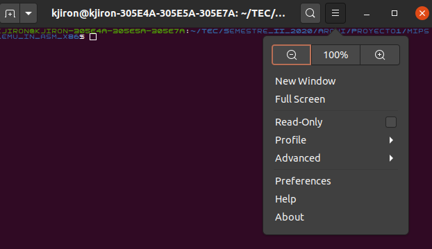
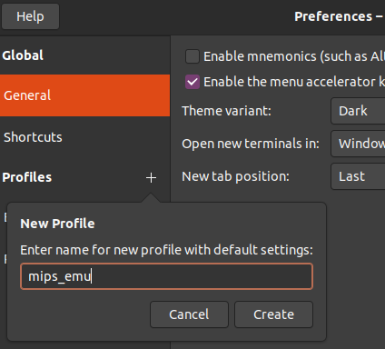
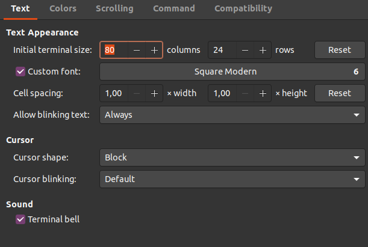
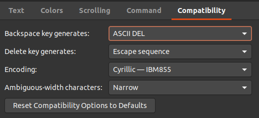
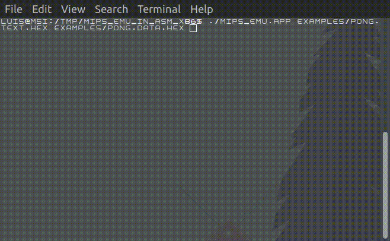
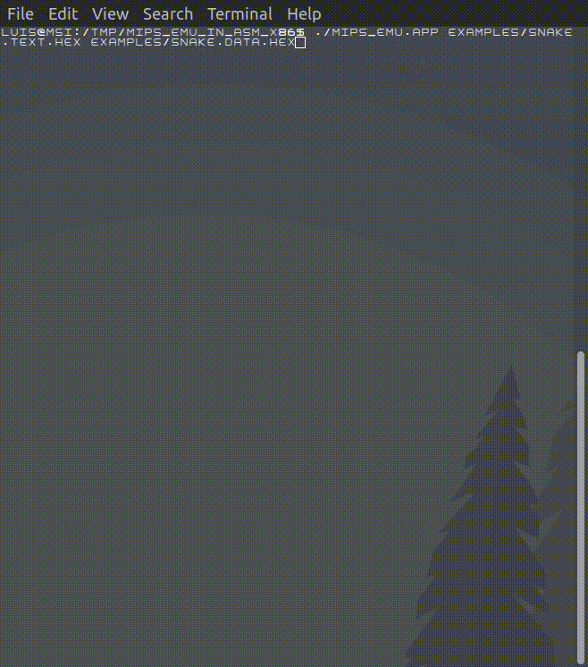

#  Designed by :black_nib:

[@eos175](https://github.com/eos175)

[@kjiron](https://github.com/kjiron)


#  MIPS Emulator in Assembly x86
The idea of this project is to do something similar to what MARS2 does, to be able to interpret
MIPS type instructions and use the linux terminal as a graphical environment to have
data output and input. All this is designed in asssembler for the x86 CPU architecture 


## Installing NASM

```shell
sudo apt-get install -y nasm
```

## You need to install special fonts for better visualization! (optional)


To do this, you must first double click on


And then click install


Now you must change the font type of the terminal in preferences




Create a new profile for the new font




Change in Custom font to Square modern size 6




In compatibility change to IBM855 this is for extended ASCII characters ('▒')




And that would be it, you already have the terminal configured properly

## How do I compile the Emulator?

```shell
make build
```

## Change the Command Line Arguments

### pong

```shell
./mips_emu.app ejemplos/pong.text.hex ejemplos/pong.data.hex
```


### snake

```shell
./mips_emu.app ejemplos/snake.text.hex ejemplos/snake.data.hex
```



You can turn on debugging, so you can see in a file each decoded instruction only by changing DEBUG to 1


## ToDo

- [x] use git
- [x] bin -> hex
- [x] do makefile
- [x] reed args
- [x] reed file
- [x] link the emulator
- [x] $gp -> pointer screen
- [x] pointer keyboard	


## References

All suggestions and criticism are welcome


[Misto423 - Assembly-Snake](https://github.com/Misto423/Assembly-Snake)

[AndrewHamm - MIPS-Pong](https://github.com/AndrewHamm/MIPS-Pong)

[Square.ttf](http://strlen.com/square/)

[Netwide Assembler - Netwide Assembler](https://es.qwe.wiki/wiki/Netwide_Assembler)

[x86_64 Linux Assembly #1 - "Hello, World!"](https://www.youtube.com/watch?v=VQAKkuLL31g)

[x86_64 Linux Assembly #12 - Reading Files](https://www.youtube.com/watch?v=BljOGzRP_Ws)

[Combine C & Assembly](https://cs.lmu.edu/~ray/notes/nasmtutorial/)

